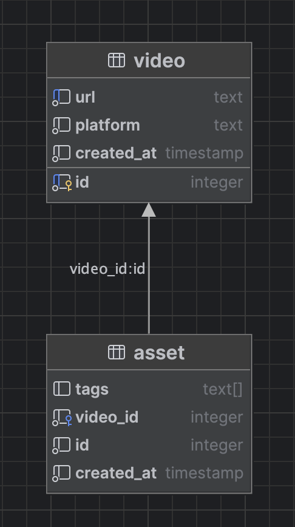

# Spark Video Take Home

https://spark-video-take-home-9ojuxpzs3-hex22a-sparks-projects.vercel.app/

## Project Setup

Install dependencies:

```shell
pnpm install
```

Start local database:

```shell
docker run --rm \
  --name spark-video-take-home-local \
  -e POSTGRES_DB=spark-video \
  -e POSTGRES_USER=pg \
  -e POSTGRES_PASSWORD=pg \
  -p 5434:5432 \
  -v ./platform_tests/schema.sql:/docker-entrypoint-initdb.d/schema.sql \
  postgres:latest
```

Run server:

```shell
pnpm dev
```

Running tests:

Platform tests (tests with a live database):

```shell
./platform_tests/test.sh
```

Unit tests:
```shell
pnpm test:unit
```

### Tech Stack

**Framework:** SvelteKit because it doesn't require a runtime on the client (unlike React)
**Persistence Layer:** PostgreSQL as a fast and reliable production database. SQL constraints are used to ensure data integrity.



#### API Routes testing

##### /api/preview

Empty JSON input:
```shell
curl -X POST -i \
http://localhost:5173/api/preview \
-H "Content-Type: application/json" \

HTTP/1.1 400 Bad Request
Vary: Origin
content-type: text/plain;charset=UTF-8
Date: Thu, 05 Feb 2026 21:28:39 GMT
Connection: keep-alive
Keep-Alive: timeout=5
Transfer-Encoding: chunked

{"error":"Unexpected end of JSON input"}
```

Malformed JSON input:

```shell
curl -X POST -i \
http://localhost:5173/api/preview \
-H "Content-Type: application/json" \
-d '{ "foo": "bar" }'
HTTP/1.1 400 Bad Request
Vary: Origin
content-type: text/plain;charset=UTF-8
Date: Thu, 05 Feb 2026 20:20:58 GMT
Connection: keep-alive
Keep-Alive: timeout=5
Transfer-Encoding: chunked

{"error":"Invalid input"}
```

Unsupported Platform:

```shell
curl -X POST -i \
http://localhost:5173/api/preview \
-H "Content-Type: application/json" \
-d '{ "url": "https://www.yahoo.com/" }'
HTTP/1.1 422 Unprocessable Entity
Vary: Origin
content-type: text/plain;charset=UTF-8
Date: Thu, 05 Feb 2026 20:22:44 GMT
Connection: keep-alive
Keep-Alive: timeout=5
Transfer-Encoding: chunked

{"error":"Unsupported platform"}
```

New video added:

```shell
curl -X POST -i \
http://localhost:5173/api/preview \
-H "Content-Type: application/json" \
-d '{ "url": "https://www.youtube.com/watch?v=6OXE65fjjsU" }'
HTTP/1.1 201 Created
Vary: Origin
content-type: text/plain;charset=UTF-8
Date: Thu, 05 Feb 2026 20:23:58 GMT
Connection: keep-alive
Keep-Alive: timeout=5
Transfer-Encoding: chunked

{"url":"https://www.youtube.com/watch?v=6OXE65fjjsU","platform":"youtube","existing_asset":null}
```

Existing Video:

```shell
curl -X POST -i \
http://localhost:5173/api/preview \
-H "Content-Type: application/json" \
-d '{ "url": "https://www.youtube.com/watch?v=6OXE65fjjsU" }'
HTTP/1.1 200 OK
Vary: Origin
content-type: text/plain;charset=UTF-8
Date: Thu, 05 Feb 2026 20:24:28 GMT
Connection: keep-alive
Keep-Alive: timeout=5
Transfer-Encoding: chunked

{"url":"https://www.youtube.com/watch?v=6OXE65fjjsU","platform":"youtube","existing_asset":{"id":3,"url":"https://www.youtube.com/watch?v=6OXE65fjjsU","platform":"youtube","created_at":"2026-02-05T16:23:58.295Z"}}
```

##### /api/assets

Empty JSON input:
```shell
curl -X POST -i \
http://localhost:5173/api/assets \
-H "Content-Type: application/json" \

HTTP/1.1 400 Bad Request
Vary: Origin
content-type: text/plain;charset=UTF-8
Date: Thu, 05 Feb 2026 21:25:37 GMT
Connection: keep-alive
Keep-Alive: timeout=5
Transfer-Encoding: chunked

{"error":"Unexpected end of JSON input"}
```

Malformed JSON input:

```shell
curl -X POST -i \
http://localhost:5173/api/assets \
-H "Content-Type: application/json" \
-d '{ "foo": "bar" }'
HTTP/1.1 400 Bad Request
Vary: Origin
content-type: text/plain;charset=UTF-8
Date: Thu, 05 Feb 2026 20:26:18 GMT
Connection: keep-alive
Keep-Alive: timeout=5
Transfer-Encoding: chunked

{"error":"Invalid input"}
```

Unsupported Platform:
```shell
curl -X POST -i \
http://localhost:5173/api/assets \
-H "Content-Type: application/json" \
-d '{ "url": "https://yahoo.com", "tags": ["Motion"] }'
HTTP/1.1 422 Unprocessable Entity
Vary: Origin
content-type: text/plain;charset=UTF-8
Date: Thu, 05 Feb 2026 20:29:21 GMT
Connection: keep-alive
Keep-Alive: timeout=5
Transfer-Encoding: chunked

{"error":"Unsupported platform"}
```

Empty tags:
```shell
curl -X POST -i \
http://localhost:5173/api/assets \
-H "Content-Type: application/json" \
-d '{ "url": "https://www.youtube.com/watch?v=AcUWbEqvAao", "tags": [] }'
HTTP/1.1 422 Unprocessable Entity
Vary: Origin
content-type: text/plain;charset=UTF-8
Date: Thu, 05 Feb 2026 21:39:57 GMT
Connection: keep-alive
Keep-Alive: timeout=5
Transfer-Encoding: chunked

{"error":"Tags cannot be empty"}
```

New URL added:

```shell
curl -X POST -i \
http://localhost:5173/api/assets \
-H "Content-Type: application/json" \
-d '{ "url": "https://www.youtube.com/watch?v=C-WhjHqYhqg", "tags": ["Color"] }'
HTTP/1.1 201 Created
Vary: Origin
content-type: text/plain;charset=UTF-8
Date: Thu, 05 Feb 2026 20:32:17 GMT
Connection: keep-alive
Keep-Alive: timeout=5
Transfer-Encoding: chunked

{"asset":{"id":9,"tags":["Color"],"video_id":5,"created_at":"2026-02-05T16:32:17.055Z"},"created":true}
```

Existing URL: (though the asset was still created but using the existing Video entity therefore 201)
```shell
curl -X POST -i \
http://localhost:5173/api/assets \
-H "Content-Type: application/json" \
-d '{ "url": "https://www.youtube.com/watch?v=C-WhjHqYhqg", "tags": ["Color"] }'
HTTP/1.1 201 Created
Vary: Origin
content-type: text/plain;charset=UTF-8
Date: Thu, 05 Feb 2026 20:33:11 GMT
Connection: keep-alive
Keep-Alive: timeout=5
Transfer-Encoding: chunked

{"asset":{"id":10,"tags":["Color"],"video_id":5,"created_at":"2026-02-05T16:33:11.380Z"},"created":false}
```
